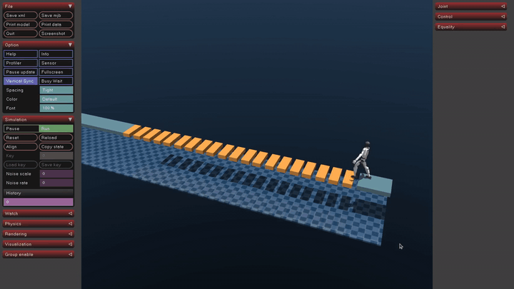

# Sim2Sim Unitree G1 Workspace

这是 `test/lidar-blindzone-heightmap` 分支，用于 Unitree G1 29DOF sim2sim 部署、激光雷达高度图桥接和实机/仿真一致性调试。

## 分支目标

本分支围绕 `unitree_rl_lab/deploy/robots/g1_29dof` 的 G1-29DOF 控制器展开，重点是：

- 将原 21DOF active policy 迁移到 29DOF 机体，并锁住新增的 8 个自由度。
- 保持 policy 的 21 个 action/observation 槽位顺序，不按 29DOF SDK natural order 重新编号。
- 接入 Livox 点云到 11x11 `height_scan` 的高度图桥接。
- 为平地、楼梯和跌倒 case 增加 MuJoCo/部署侧诊断输出。

## Sim2Sim 演示视频



高清 MP4：
`docs/media/lidar_sim2sim_stable_walk.mp4`

这段是本分支的激光雷达 `height_scan` sim2sim 演示：G1-29DOF 在 MuJoCo 台阶场景中使用 lidar heightmap 输入完成稳定行走全程。原始录屏为
`simplescreenrecorder-2026-07-17_14.14.42.mp4`，已检查并只保留稳定有效段
`7.2s-17.8s`；`7s` 前主要是起步/等待，`18s` 后进入终点姿态，未放入 README 演示视频。

## 主要目录

- `unitree_rl_lab/deploy/robots/g1_29dof/`：G1-29DOF 控制器、策略配置、heightmap bridge 和诊断代码。
- `unitree_mujoco/`：Unitree MuJoCo 仿真环境、机器人 XML、场景和 DDS bridge。
- `deploy_lstm/`：早期 LSTM/感知部署实验和辅助分析脚本。
- `unitree_sdk2/`：Unitree SDK2 依赖与示例。

## 当前策略

当前调试策略位于：

```text
unitree_rl_lab/deploy/robots/g1_29dof/config/policy/velocity/lidar_blindwalking_model2600
```

该策略的 ONNX 输入输出约定：

- observation: `[1, 193]`
- action: `[1, 21]`
- `height_scan`: 121 维

## 本分支运行顺序

终端 1，启动 MuJoCo：

```bash
cd /home/ubt2204/work/111/TRY/sim2sim/unitree_mujoco/simulate
./build/unitree_mujoco --network lo --domain_id 0
```

终端 2，启动高度图桥接：

```bash
cd /home/ubt2204/work/111/TRY/sim2sim/unitree_rl_lab/deploy/robots/g1_29dof
./scripts/run_lidar_blindwalking_model2600_heightmap_bridge.sh
```

终端 3，启动控制器：

```bash
cd /home/ubt2204/work/111/TRY/sim2sim/unitree_rl_lab/deploy/robots/g1_29dof
./build/g1_ctrl --network lo
```

## 注意

这是机器人部署调试工作区。实机测试前需要确认急停、吊挂/保护措施、网络 domain、DDS topic 和策略/关节顺序完全匹配。

## License

本工作区原创代码、文档、脚本和演示媒体默认使用 MIT License，见
`LICENSE`。第三方组件保留各自许可证，见 `THIRD_PARTY_NOTICES.md` 和各
third-party 目录内的 license 文件。
